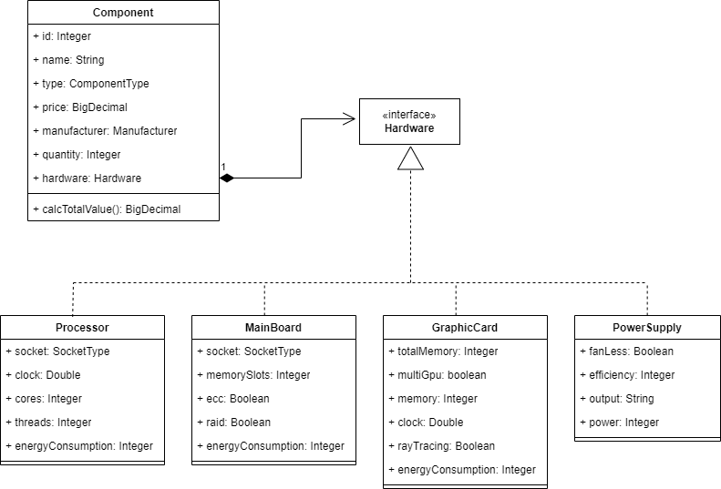

# CSS - Computer Self-Service

## Pre-requirements
- Java >= 17
- Maven >= 3.8.1
- Spring Boot >= 3.1.2

## Running Locally
mvn clean install
mvn spring-boot:run

## Creating new components
Example using Visual Studio Code Rest Client plugin:
```json
POST http://localhost:8080/components
content-type: application/json

{
  "components": 
  [
    { 
      "name":"B550M Aorus Elite Micro ATX AM4", 
      "manufacturer" : "GIGABYTE",
      "type" : "MAIN_BOARD",
      "price": 899.99, 
      "quantity": 10,
      "mainBoard" : {
        "socket":"LGA",
        "memorySlots": 4,
        "ecc": true,
        "raid": true,
        "energyConsumption": 30
      }
    },
    { 
      "name":"AMD Ryzen 5 5600G", 
      "manufacturer" : "AMD",
      "type" : "PROCESSOR",
      "price": 1549.99, 
      "quantity":10,
      "processor" : {
        "socket":"LGA",
        "clock":3,
        "cores":4,
        "threads":4,
        "energyConsumption": 20      
      }
    }
  ]    
}
```
## Expanding the system to support a new Hardware type
1. Create the new class to represent the Hardware and implement on it the Hardware interface.
2. Add a test for the new hardware on the ComponentTest.
3. Add the new type on the ComponentTypeEnum. 
4. Update the Component class adding the get method for the new Hardware.
5. Update the ComponentValidator.
6. Update the ComponentConverter.
7. At framework package, create the Entity for the new Component table.
8. At framework package, update the ComponentEntityConverter.

## Current system Component/Hardware model

